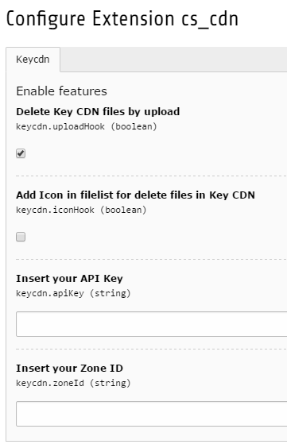

.. ==================================================
.. FOR YOUR INFORMATION
.. --------------------------------------------------
.. -*- coding: utf-8 -*- with BOM.

.. include:: ../Includes.txt

.. _introduction:

Configuration
=============

Extension Configurations
"""""""""""""""""""""""""

The extension provides four settings for the configuration.

.. ### BEGIN~OF~TABLE ###

.. container:: table-row

   Property
         keycdn.uploadHook

   Data type
         boolean

   Description
         Delete Key CDN files by upload

   Default
         1

.. container:: table-row

   Property
         keycdn.iconHook

   Data type
         boolean

   Description
         Add Icon in filelist for delete files in Key CDN

   Default
         0

.. container:: table-row

   Property
         keycdn.apiKey

   Data type
         string

   Description
         Insert your API Key

   Default
        empty

.. container:: table-row

   Property
         keycdn.zoneId

   Data type
         string

   Description
         Insert your Zone ID

   Default
        empty

.. ###### END~OF~TABLE ######