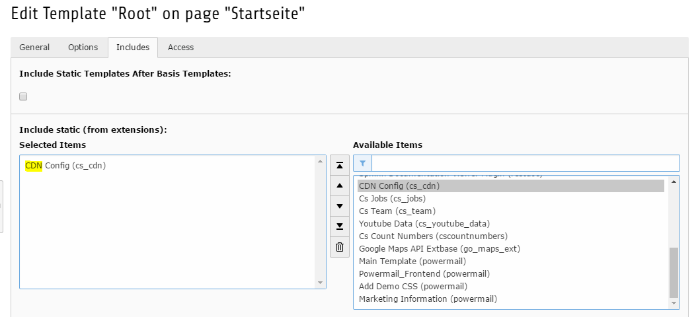
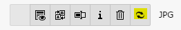

.. ==================================================
.. FOR YOUR INFORMATION
.. --------------------------------------------------
.. -*- coding: utf-8 -*- with BOM.

.. include:: ../Includes.txt

.. _users-manual:

Users manual
============

#. Just download the Extension with the Extension Manager and activate it.

#. Include the Typoscript CDN config (cs_cdn) from "Availible Items" to "Selected Items".

#. At the end clear all cache.

- The optional Button to clear CDN cache.

